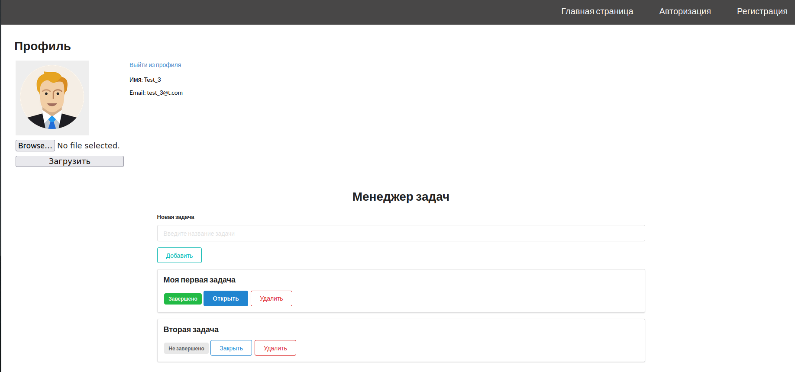

# Personal to-do list
Drawing up a personal list of tasks with the ability to change the status of their implementation.


## Profile page example:



## Requirements
- Python;
- Flask;
- SQLite;
- Docker / docker-compose.

## Installation
To run the application, clone the repository and use the command
```bash
docker-compose up --build
```
